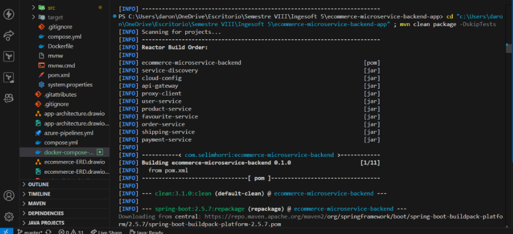
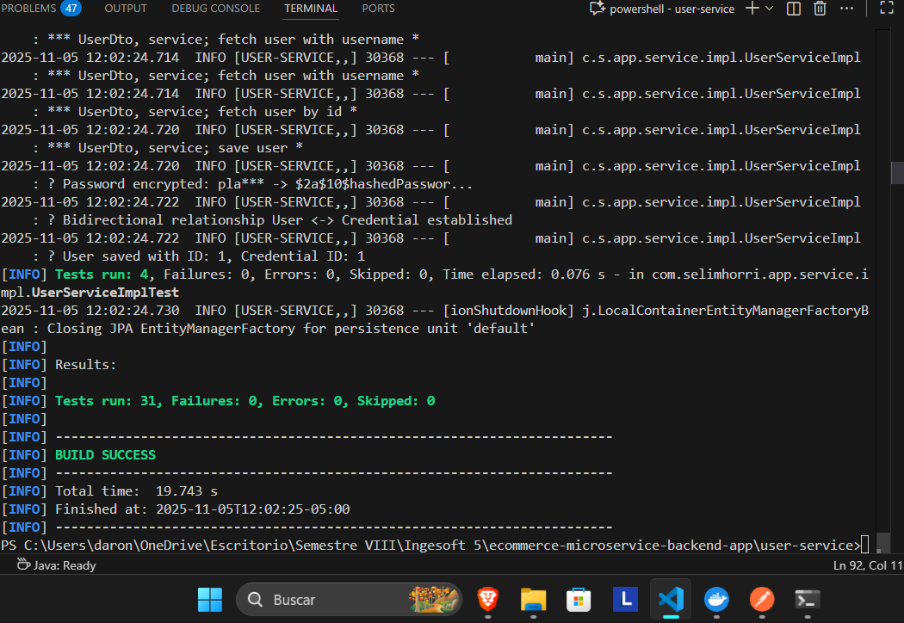
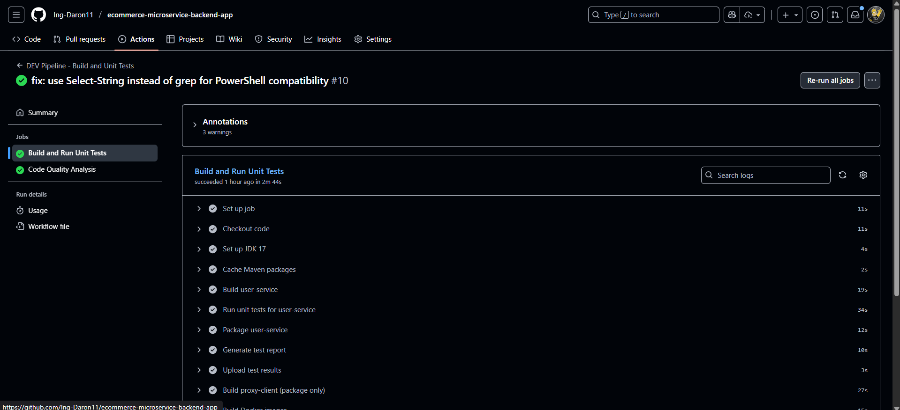

# E-Commerce Microservices Backend Application

## 1. Descripción General

Sistema de microservicios para plataforma e-commerce desarrollado en Java Spring Boot con arquitectura completa de servicios distribuidos.

**Tecnologías utilizadas:**
- Java 17 + Spring Boot 2.5.7
- Spring Cloud 2020.0.4
- Spring Security + JWT
- Spring Data JPA + Hibernate
- MySQL
- Docker + Kubernetes (Minikube)
- GitHub Actions (CI/CD)
- Zipkin (Distributed Tracing)
- Eureka Service Discovery

---


### Servicios Implementados

| Servicio | Puerto | Descripción |
|----------|--------|-------------|
| API Gateway | 8080 | Puerta de entrada única |
| User Service | 8700 | Autenticación y gestión de usuarios |
| Product Service | 8500 | Catálogo de productos |
| Favourite Service | 8800 | Favoritos del usuario |
| Order Service | 8300 | Gestión de pedidos |
| Payment Service | 8400 | Procesamiento de pagos |
| Shipping Service | 8600 | Gestión de envíos |
| Proxy Client | 8900 | Cliente HTTP inter-servicios |
| Eureka | 8761 | Service Discovery |
| Cloud Config | 9296 | Configuración centralizada |
| Zipkin | 9411 | Distributed Tracing |

---

## 3. Configuración Inicial

### Requisitos
- Java 17+
- Maven 3.8+
- Docker
- Minikube
- kubectl

### Pasos de Instalación

 **Clonar repositorio**
```bash
git clone https://github.com/Ing-Daron/ecommerce-microservice-backend-app.git
cd ecommerce-microservice-backend-app
```
 **Se construye el proyecto**
```bash
mvn clean compile -DskipTests
```


 **Compilar servicios**
```bash
mvn clean package -DskipTests
```



 **Iniciar Minikube**
```bash
minikube start --driver=docker
```

 **Compilar imágenes Docker**
```bash
eval $(minikube docker-env)
# Para cada servicio:
cd <service>
docker build -t <service>:v0.1.0 .
cd ..
```
Ejemplo con el cloud-config:


 **Comando para apuntar Minikube desde la consola**
```bash
 minikube docker-env --shell powershell | Invoke-Expression
```

 **Desplegar en Kubernetes**
```bash
kubectl apply -f user-service/k8s/
kubectl apply -f product-service/k8s/
# ... resto de servicios
```


---

##  Cambios Implementados

###  Encriptación de Contraseñas

**Archivo:** `user-service/src/main/java/.../UserServiceImpl.java`

**Cambio:** Implementar BCryptPasswordEncoder para almacenar contraseñas encriptadas

```java
@Autowired
private PasswordEncoder encoder;

public void save(User user) {
    String encodedPassword = encoder.encode(user.getPassword());
    user.setPassword(encodedPassword);
    userRepository.save(user);
}
```

**Resultado:** Contraseñas almacenadas con formato `$2a$10$...`

###  Corrección de Migraciones Flyway

**Archivos:**
- `db/migration/V10__Add_shipping_address_to_users.sql`
- `db/migration/V11__Add_addresses_table.sql`

**Cambio:** Corregir sintaxis de foreign keys con ON DELETE CASCADE

```sql
ALTER TABLE addresses ADD CONSTRAINT fk_user_id
FOREIGN KEY (user_id) REFERENCES users(id) ON DELETE CASCADE;
```

###  Eliminación de Beans Duplicados

**Eliminado:** `PasswordEncoderConfig.java`

**Resultado:** Resolución de conflicto de beans en Spring

### Actualización de Dependencias

- Actualizado Spring Boot a versión compatible
- Actualizadas librerías de seguridad
- Configurado Flyway para migraciones automáticas

---

## Testing

###  Unit Tests

**Total:** 21 tests pasando (100%)

**Archivos:**
- `UserServiceImplTest.java` - 4 tests
- `CredentialRepositoryTest.java` - 5 tests  
- `UserMappingHelperTest.java` - 4 tests
- `EncoderConfigTest.java` - 5 tests
- `AddressServiceImplTest.java` - 2 tests

**Ejecución:**
```bash
mvn test -Dtest='!*IntegrationTest,!*E2ETest'
```

### Integration Tests

**Total:** 10 tests pasando (100%)

**Archivos:**
- `UserServiceIntegrationTest.java` - 5 tests
- `CredentialServiceIntegrationTest.java` - 5 tests

**Ejecución:**
```bash
mvn test -Dtest='*IntegrationTest'
```


---

## CI/CD Pipelines

### DEV Pipeline

**Archivo:** `.github/workflows/dev-pipeline.yml`

**Trigger:** Push a `master`

**Pasos:**
1. Checkout código
2. Setup JDK 17
3. Build user-service
4. Ejecutar unit tests
5. Package JAR
6. Build Docker image




### STAGE Pipeline

**Archivo:** `.github/workflows/stage-pipeline.yml`

**Trigger:** Push a `master`

**Pasos:**
1. Build ambos servicios
2. Verificar Minikube
3. Build Docker images
4. Deploy a Kubernetes
5. Ejecutar integration tests


### Configuración del Runner
Para esto se configuró un Runner de github debido a que todo es local.

**Runner:** Autohospedado en Windows (máquina LOKI (mi pc personal))

---

## 7. Trazabilidad con Zipkin

### Acceso a Zipkin

```bash
kubectl port-forward svc/zipkin 9411:9411
# Abrir: http://localhost:9411
```

### Generar Tráfico

```bash
powershell -ExecutionPolicy Bypass -File generate-zipkin-traffic.ps1
```

### Ver Dependencias

Ir a "Dependencies" en Zipkin para visualizar el grafo de microservicios.


---

## 8. Documentación por Servicio

- [User Service](./user-service/README.md)
- [Product Service](./product-service/README.md)
- [Favourite Service](./favourite-service/README.md)
- [Order Service](./order-service/README.md)
- [Payment Service](./payment-service/README.md)
- [Shipping Service](./shipping-service/README.md)
- [API Gateway](./api-gateway/README.md)

---

## 9. Comandos Útiles

```bash
# Kubernetes
kubectl get pods
kubectl get svc
kubectl logs <pod-name>
kubectl port-forward svc/<service> <local>:<remote>

# Maven
mvn test
mvn clean package -DskipTests
mvn spring-boot:run

# Minikube
minikube start --driver=docker
minikube status
minikube dashboard
```

---

## 10. Troubleshooting

| Error | Solución |
|-------|----------|
| Pod no inicia | `kubectl describe pod <name>` |
| Conexión rechazada | `kubectl port-forward svc/...` |
| Migración fallida | Revisar logs: `kubectl logs <pod>` |
| Tests no pasan | Verificar BD con `kubectl exec <pod> --` |

---

## Autor
Daron - Semestre VIII - Ingeniería de Software 5

**Última actualización:** Noviembre 5, 2025

**Estado:** Sistema operacional con CI/CD activo

