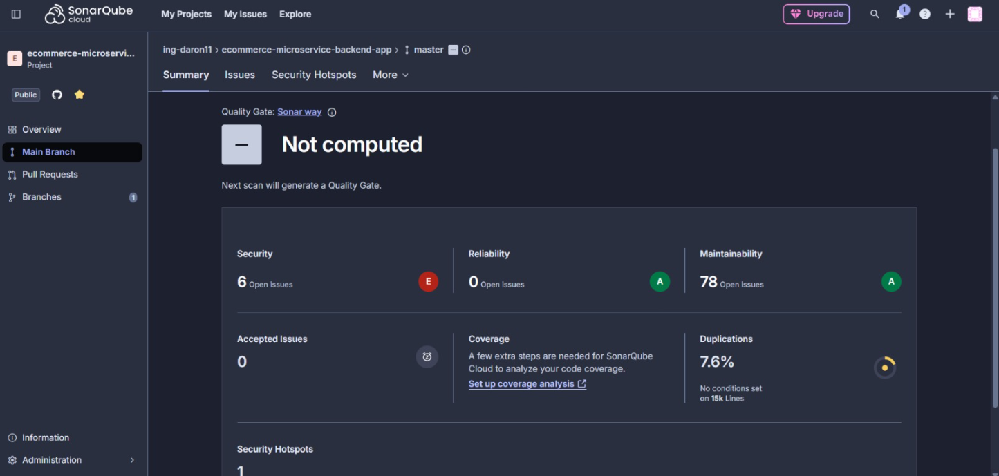
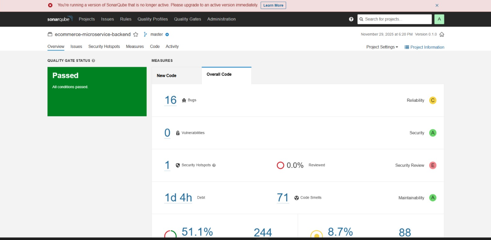
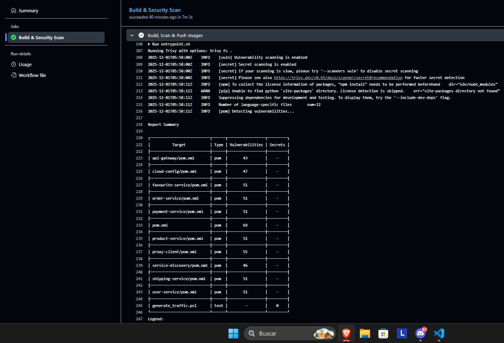
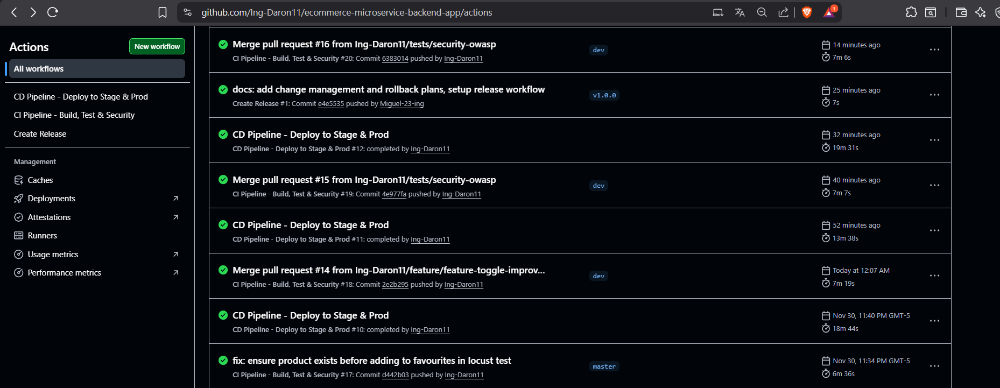
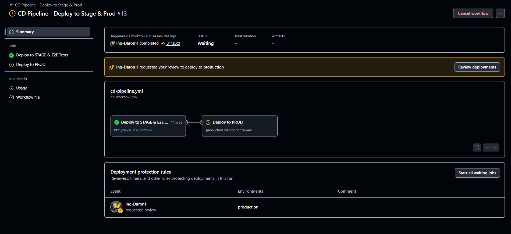
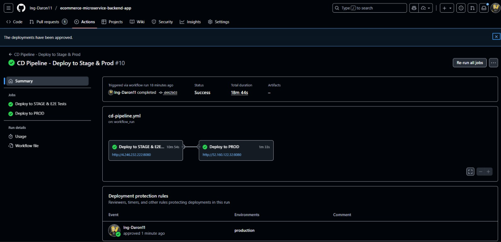
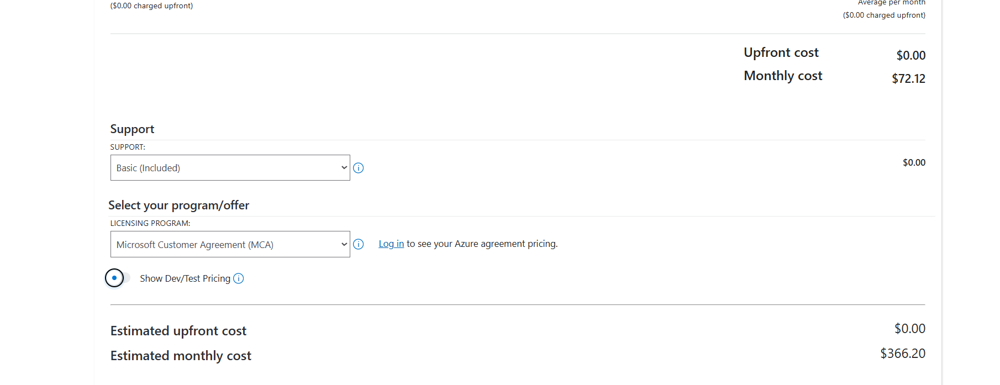
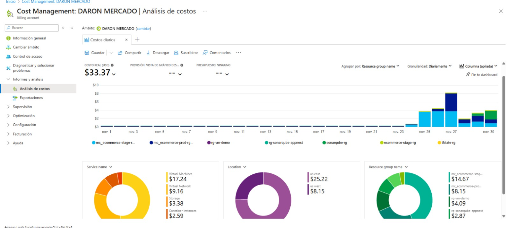

# E-Commerce Microservices Backend Application - Cloud Architecture

<div align="center">


</div>

---

## Tabla de Contenidos
- [Integrantes](#integrantes)
- [Descripción General](#1-descripción-general)
- [Arquitectura de Infraestructura](#2-arquitectura-de-infraestructura-en-azure)
- [Estrategia de Calidad (SonarQube)](#3-estrategia-de-calidad-de-código-sonarqube)
- [Pipelines de CI/CD](#4-pipelines-de-cicd-github-actions)
- [Costos de Infraestructura](#5-costos-de-infraestructura)
- [Manual de Operaciones](#6-manual-de-operaciones-básico)

---

## Integrantes

| Nombre | GitHub |
|--------|--------|
| **Daron** | [@Ing-Daron11](https://github.com/Ing-Daron11) 
| **Miguel** | [@Miguel-23-ing](https://github.com/Miguel-23-ing) 


---

## 1. Descripción General

Plataforma de comercio electrónico de alto rendimiento basada en una arquitectura de microservicios moderna y escalable. Desarrollada con el ecosistema **Java Spring Boot** y **Spring Cloud**, esta solución implementa patrones de diseño distribuidos robustos como Service Discovery, API Gateway y Distributed Tracing.

La infraestructura reside completamente en la nube de **Microsoft Azure**, orquestada por **Azure Kubernetes Service (AKS)** y gestionada mediante prácticas avanzadas de **DevSecOps**. El ciclo de vida del software está automatizado con **GitHub Actions**, integrando análisis de calidad con **SonarQube** y escaneo de seguridad con **Trivy**.

> **Nota:** Para consultar la guía detallada de instalación local (Minikube), configuración de herramientas y el historial de desarrollo paso a paso, por favor revise el archivo [LOCALREADME.md](./LOCALREADME.md).

## 2. Arquitectura de Infraestructura en Azure

Para soportar la carga de trabajo y garantizar un ciclo de vida de software profesional, se ha migrado de un entorno local (Minikube) a una infraestructura robusta en la nube utilizando Azure Kubernetes Service (AKS).

### Estrategia de Despliegue y Regiones
Se han creado dos clusters de Kubernetes independientes para aislar los entornos y simular un escenario real de producción con redundancia geográfica:

1.  **Cluster de Stage (Pruebas):**
    *   **Región:** `East US`
    *   Utilizado para despliegues automáticos desde la rama de desarrollo y ejecución de pruebas de integración.
2.  **Cluster de Prod (Producción):**
    *   **Región:** `West US`
    *   Entorno estable y aislado donde llegan las versiones aprobadas para producción.

### Especificaciones de los Nodos
Para optimizar la relación costo-beneficio manteniendo el rendimiento necesario para microservicios Java (Spring Boot), se seleccionó la instancia **Standard_E2s_v3** para los pools de agentes.

*   **Tipo de Instancia:** `Standard_E2s_v3`
*   **RAM:** 16 GB
*   **vCPU:** 2 vCPU
*   **Justificación:** Esta capacidad permite alojar múltiples pods de microservicios Java, que tienden a consumir memoria significativa en el arranque, sin sufrir desalojos por falta de recursos (OOMKilled).

### Comandos de Provisionamiento (Azure CLI)
A continuación, se detallan los comandos utilizados para recrear la infraestructura base:

```bash
# 1. Crear Grupo de Recursos (Ejemplo para Prod en East US)
az group create --name ecommerce-prod-rg --location eastus

# 2. Crear Azure Container Registry (ACR) para almacenar imágenes Docker
az acr create --resource-group ecommerce-prod-rg --name ecommerceacr --sku Basic

# 3. Crear Cluster AKS (Producción)
# Se utiliza el tamaño de nodo Standard_E2s_v3 (2 vCPU, 16GB RAM)
az aks create \
  --resource-group ecommerce-prod-rg \
  --name ecommerce-prod-aks \
  --node-count 1 \
  --node-vm-size Standard_E2s_v3 \
  --generate-ssh-keys

# 4. Obtener credenciales para kubectl
az aks get-credentials --resource-group ecommerce-prod-rg --name ecommerce-prod-aks
```

---

## 3. Estrategia de Calidad de Código (SonarQube)

Inicialmente, se intentó utilizar **SonarCloud** para el análisis estático de código. Sin embargo, se identificó una limitación crítica en su capa gratuita: solo permitía el análisis de la rama por defecto (`master`), dejando sin cobertura las ramas de características (`feature/*`) o desarrollo.



**Solución Implementada:**
Se desplegó una instancia **Self-hosted de SonarQube** utilizando **Azure Container Instances (ACI)**.
*   Esto nos permite control total sobre las reglas de calidad.
*   Permite analizar múltiples ramas sin costos de licenciamiento adicionales.
*   Se integró directamente en el pipeline de CI para bloquear código que no cumpla con los estándares de calidad (Quality Gates).



### Despliegue de SonarQube en ACI
Comando utilizado para levantar la instancia de SonarQube en Azure Container Instances:

```bash
az container create \
  --resource-group ecommerce-prod-rg \
  --name sonarqube-server \
  --image sonarqube:lts \
  --ports 9000 \
  --dns-name-label ecommerce-sonarqube \
  --cpu 2 \
  --memory 4
```


---

## 4. Pipelines de CI/CD (GitHub Actions)

Se ha reestructurado la automatización en dos pipelines diferenciados para separar la integración continua de la entrega continua.

### CI Pipeline (Integración Continua)
Este pipeline se ejecuta en cada Push o Pull Request. Sus responsabilidades son:
1.  **Build:** Compilación del proyecto con Maven.
2.  **Unit Tests:** Ejecución de pruebas unitarias.
3.  **Code Analysis:** Escaneo de código con SonarQube (Self-hosted).
4.  **Security Scan:** Escaneo de vulnerabilidades en dependencias e imágenes con Trivy.
5.  **Artifact Push:** Construcción y subida de imágenes Docker a Azure Container Registry (ACR).



### CD Pipeline (Despliegue Continuo)
Este pipeline se activa tras una ejecución exitosa del CI en la rama principal. Sus responsabilidades son:
1.  **Deploy:** Despliegue de los nuevos manifiestos en el cluster de AKS (Stage/Prod).
2.  **E2E Testing:** Ejecución de pruebas de extremo a extremo utilizando **Newman (Postman)** para validar flujos de negocio completos.
3.  **Load Testing:** Ejecución de pruebas de carga con **Locust** para asegurar que el sistema soporta concurrencia.



### Estrategia de Promoción a Producción
Para garantizar la estabilidad del sistema, se ha implementado un mecanismo de **aprobación manual** utilizando GitHub Environments.
*   El despliegue al entorno de **Stage** es automático tras pasar el CI.
*   El despliegue al entorno de **Producción** está protegido y requiere la aprobación explícita de un administrador en GitHub. Esto asegura que solo las versiones que han sido validadas exitosamente en Stage (pasando pruebas E2E y de carga) sean promovidas.




---

## 5. Costos de Infraestructura

A continuación se presenta el desglose estimado de los costos mensuales de la infraestructura utilizada en Azure, calculado utilizando la Calculadora de Precios de Azure. Incluye costos de AKS, ACR, ACI (SonarQube) y almacenamiento asociado.





---

## 6. Manual de Operaciones Básico

Esta sección describe los comandos esenciales para la gestión y mantenimiento de la infraestructura en Azure.

### Gestión de Contextos de Kubernetes
Para interactuar con los diferentes clusters (Stage vs Prod), es necesario cambiar el contexto de `kubectl`.

**Ver contextos disponibles:**
```bash
kubectl config get-contexts
```

**Cambiar al entorno de Stage:**
```bash
kubectl config use-context ecommerce-stage-aks
```

**Cambiar al entorno de Producción:**
```bash
kubectl config use-context ecommerce-prod-aks
```

### Gestión de Costos (Encendido/Apagado)
Para evitar costos innecesarios cuando los entornos no están en uso (especialmente Stage), se recomienda detener los clusters.

**Detener el cluster de Producción:**
```bash
az aks stop --name ecommerce-prod-aks --resource-group ecommerce-prod-rg
```

**Iniciar el cluster de Producción:**
```bash
az aks start --name ecommerce-prod-aks --resource-group ecommerce-prod-rg
```

### Monitoreo y Logs
Comandos básicos para verificar el estado de los servicios en el cluster activo.

**Ver estado de los pods:**
```bash
kubectl get pods
```

**Ver logs de un servicio específico:**
```bash
kubectl logs <nombre-del-pod>
```

---

**Última actualización:** Diciembre 1, 2025

---

## 11. Observabilidad y Monitoreo

### Stack Implementado
- **Prometheus**: Recolección de métricas (Puerto 9090)
- **Grafana**: Visualización de métricas (Puerto 3000)

### Acceso

**Prometheus:**
```bash
http://localhost:9090
```

**Grafana:**
```bash
http://localhost:3000
# Usuario: admin
# Contraseña: admin
```

### Configuración
Las métricas se exponen en `/actuator/prometheus` en cada microservicio.
Prometheus está configurado para hacer scraping de todos los servicios definidos

