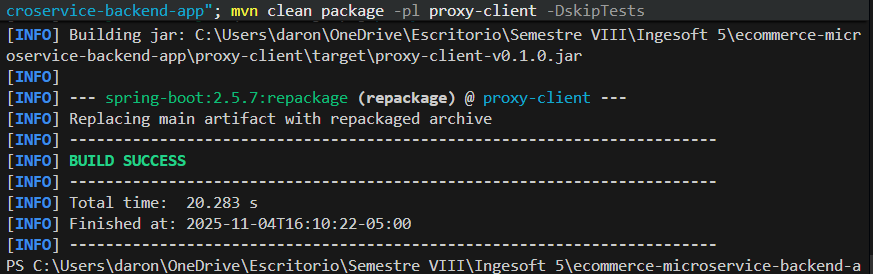

# Proxy-Client - Correcciones Realizadas

## Resumen

Se implementó una arquitectura de autenticacion y autorizacion en el proxy-client optimizada para el flujo de microservicios, manteniendo separacion de responsabilidades.

## Cambios Implementados

### SecurityConfig.java
- Implementación de politica de seguridad basada en niveles: publicos, autenticados, administrador
- Configuracion de JWT authentication via JwtRequestFilter
- Autenticacion centralizada en proxy-client
- Autorizacion delegada a cada microservicio segun su logica de negocio

### Controladores REST (9 archivos)
- UserController: Endpoints para gestion de usuarios con autenticacion requerida
- CredentialController: Endpoints para credenciales con validacion de tokens
- VerificationTokenController: Endpoints para tokens de verificacion
- AddressController: Endpoints para direcciones de usuarios
- CartController: Endpoints para carrito de compras
- OrderController: Endpoints para ordenes de compra
- PaymentController: Endpoints para pagos
- FavouriteController: Endpoints para favoritos
- OrderItemController: Endpoints para items en ordenes

Todos los controladores implementan:
- Autenticacion JWT requerida (excepto endpoints publicos)
- Delegacion de autorizacion al servicio correspondiente
- Manejo consistente de excepciones y respuestas

## Arquitectura de Seguridad

- Autenticacion: Proxy-Client valida tokens JWT
- Autorizacion: Cada microservicio valida reglas de negocio
- Trazabilidad: Sleuth/Zipkin mantiene trazas distribuidas
- Descubrimiento: Eureka service discovery operativo

## Compilacion

```bash
mvn clean package -pl proxy-client -DskipTests
```

Estado: COMPILACION EXITOSA (proxy-client-v0.1.0.jar generado)
