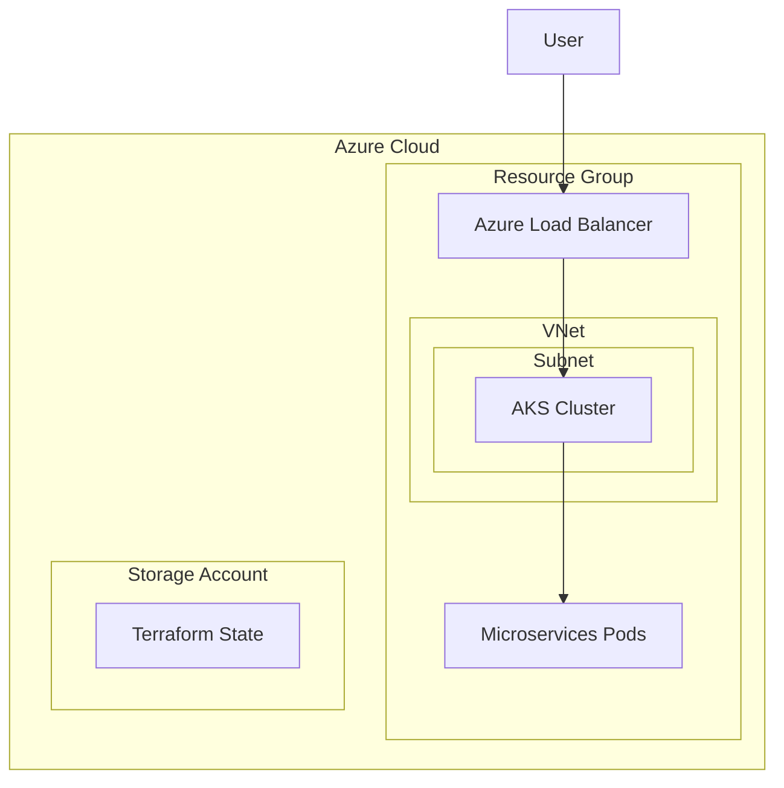

# Infrastructure Architecture

This project uses Terraform to provision the infrastructure on Azure.

## Architecture Diagram

## Modules

- **Network**: Provisions Virtual Network and Subnet.
- **AKS**: Provisions Azure Kubernetes Service cluster.

## Environments

- **Stage**: Staging environment for testing.
- **Prod**: Production environment.

## Setup

1. Run `setup_backend.ps1` to create the Azure Storage Account for Terraform state.
2. Navigate to `terraform/environments/stage` or `prod`.
3. Run `terraform init`.
4. Run `terraform apply`.
